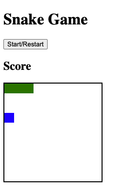

# Classic Snake Game

A classic Snake Game built with pure JavaScript, HTML, and CSS.

Features:

-   Start and/or restart a game
-   Use physical keyboard arrow keys to move snake
-   Use on-screen arrow buttons to move snake
-   UI displays 'Game Over' when snake hits any of the walls

**Credit**: This project was completed in the [Frontend Developer Career Path course on Scrimba](https://scrimba.com/learn/frontend). The original project was unstyled and was made with basic snake game functionality with just a Start/Restart button.

Since completing the game project in Scrimba, I've added additional functionality by allowing screen only users (users without a access to a physical keyboard) to move the snake with arrow buttons on a screen and showing the user that the game is over when the snake hits any wall or itself.
